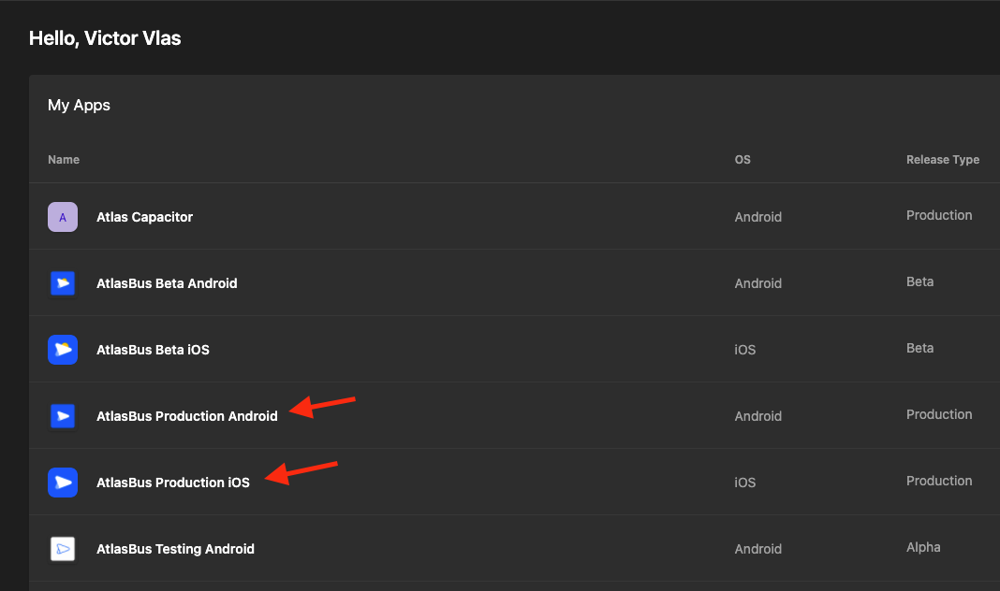
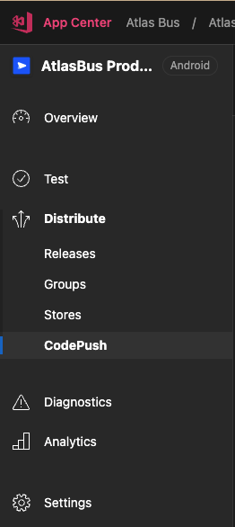
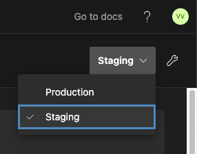
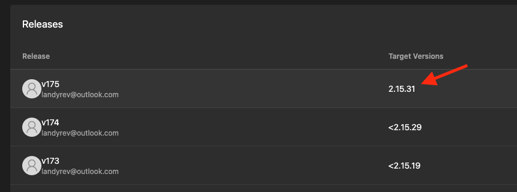
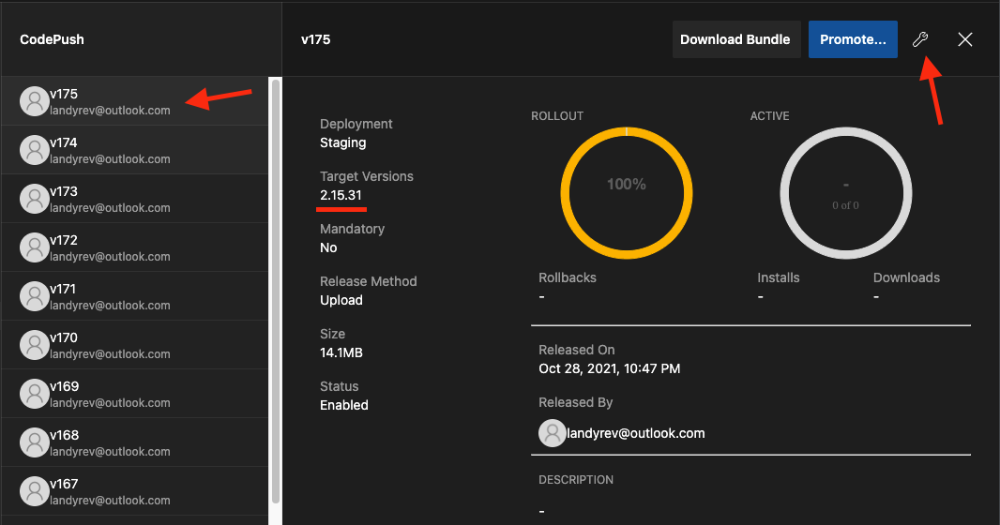
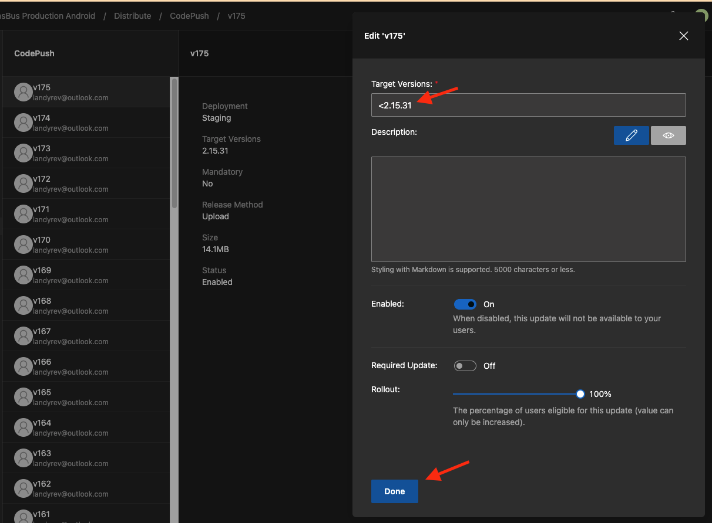
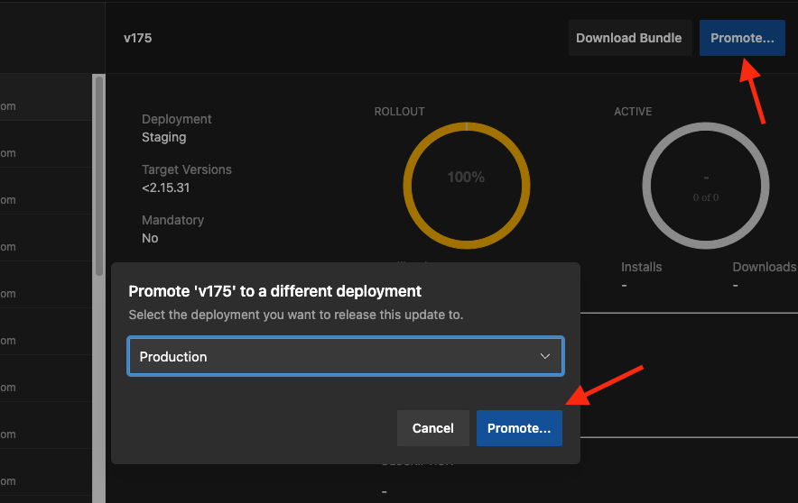
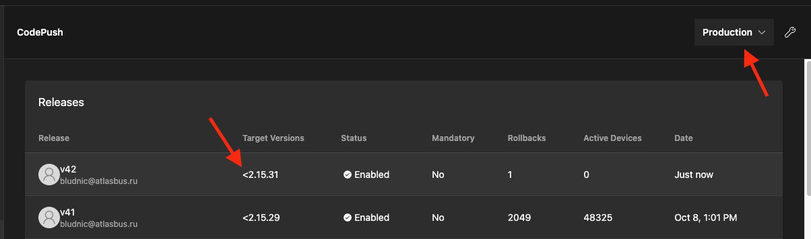

# Релиз приложения AtlasBus в CodePush

После успешной сборки в Bitrise, бандлы приложения загружаются в CodePush. Ниже описано как сделать релиз приложения.

1. Войдите в App Center https://appcenter.ms
2. Выберите проект `AtlasBus Production Android` или `AtlasBus Production iOS`, в зависимости какую платформу хотите зарелизить

3. Перейдите на вкладку `Distribute -> CodePush`

4. В правом верхнем углу переключитесь с `Production` на `Staging`

5. В таблице должен появится только что собранный релиз

6. В правом верхнем углу нажмите на гаечный ключ

7. В окне редактирования релиза поменяйте `Target Versions`. Добавьте символ "<" перевод номером версии. К примеру, было `2.15.31`, стало `<2.15.31`

8. Описание к релизу (поле `Description`) можно заполнить по желанию. Нажмите `Done`

10. Нажмите `Promote`

11. Переключитесь обратно на `Production`. В таблице должен появится ваш релиз

